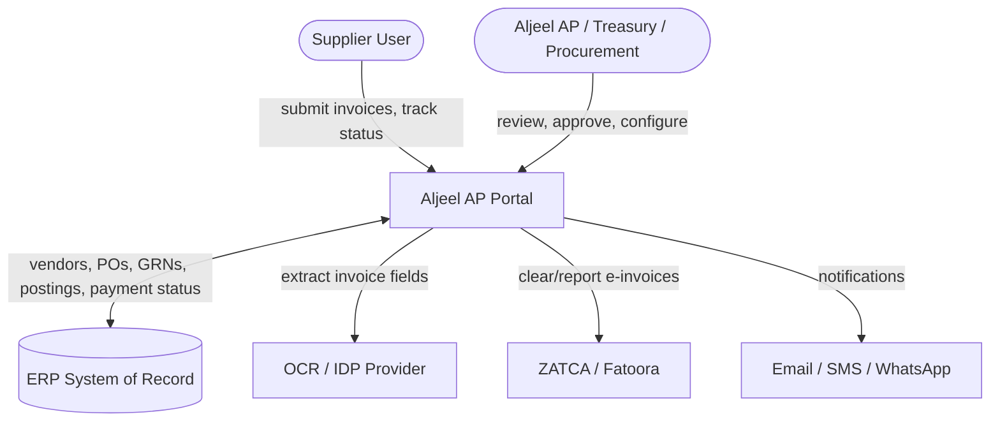
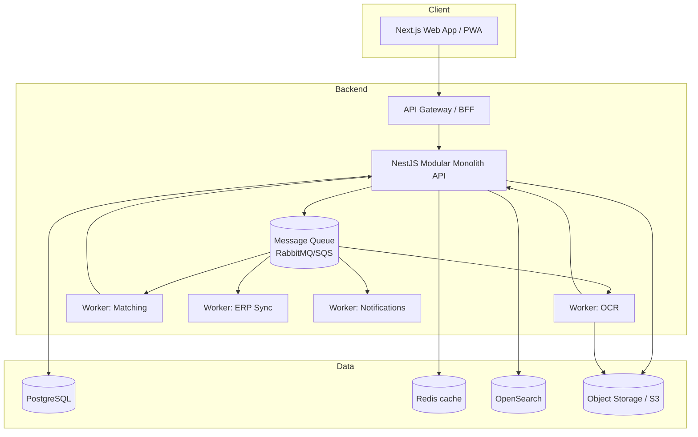
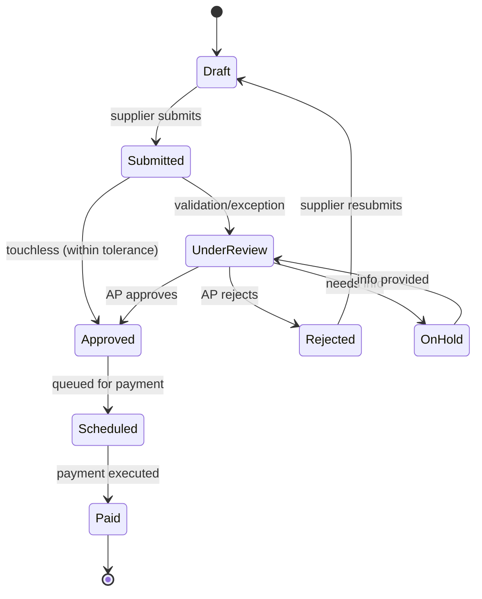
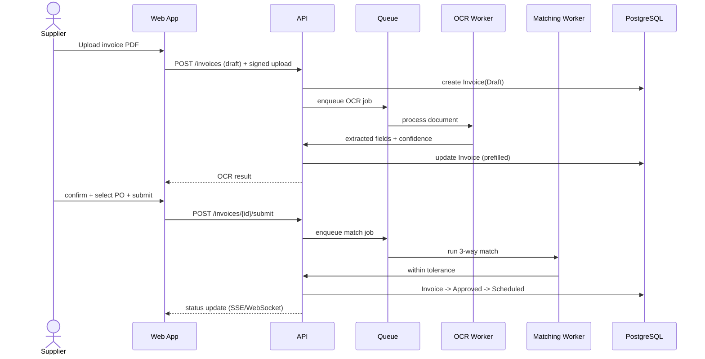

# Aljeel Supplier AP Portal — Architecture

> How the system fits together. Pair with `SPECIFICATION.md` (what) and `DATA_MODEL.md` (entities).

---

## 1. Architecture Style

A **modular monolith** with clearly separated bounded contexts that can be extracted into
independent services later. This minimizes early operational overhead while keeping clean
seams for scaling. Async work (OCR, matching, ERP sync, notifications) runs through a
message queue so the request path stays fast and resilient.

### Bounded contexts (modules)
| Module | Responsibility |
|---|---|
| Identity & Access | Auth, RBAC, tenants, MFA |
| Vendor Management | Onboarding, master data, bank verification (maker-checker) |
| Document Ingestion | Upload, storage, OCR/IDP orchestration, virus scan |
| Invoice Processing | Validation, dedup, matching, lifecycle state machine |
| Workflow/Approvals | Rules engine, DOA, escalations |
| Payments & Remittance | Payment status, remittance publishing |
| Notifications | Email/SMS/in-app, templates |
| Integration | ERP connectors, ZATCA, OCR providers, webhooks |
| Analytics/Reporting | Dashboards, exports, BI feed |

---

## 2. System Context (C4 — Level 1)



---

## 3. Container View (C4 — Level 2)



---

## 4. Invoice Lifecycle State Machine

The invoice is modeled as an explicit finite state machine to prevent illegal transitions
and to make the audit trail unambiguous.



---

## 5. Happy-Path Submission Sequence



---

## 6. Technology Stack & Rationale

| Layer | Choice | Why |
|---|---|---|
| Frontend | Next.js + TypeScript | SSR performance, great DX, strong RTL/i18n ecosystem |
| UI | Tailwind + shadcn/ui | Fast, consistent, accessible, easy RTL mirroring |
| Server state | TanStack Query | Caching, retries, optimistic UI for uploads |
| Forms | React Hook Form + Zod | Shared validation schemas with backend |
| Backend | NestJS (TypeScript) | Modular, opinionated, shares types with FE |
| DB | PostgreSQL | Relational system of record, strong constraints |
| Cache | Redis | Sessions, PO lookups, rate limits |
| Search | OpenSearch | Fast invoice/document search |
| Storage | S3-compatible | Encrypted document storage, signed URLs |
| Queue | RabbitMQ / SQS / Kafka | Async OCR, matching, ERP sync, notifications |
| OCR/IDP | Azure DI / Textract / Rossum | Field extraction with confidence scoring |
| Auth | Keycloak / Azure AD B2C | OIDC, MFA, external identity for suppliers |
| Infra | Docker + Kubernetes + Terraform | Reproducible, scalable deployments |
| Observability | Prometheus, Grafana, OpenTelemetry | Metrics, tracing, logs |

> If Aljeel's IT standard is JVM or Microsoft, **Spring Boot** or **.NET** are equally
> valid tier‑1 backend choices. Keep the bounded-context structure identical.

---

## 7. Cross-Cutting Concerns

- **Multi-tenancy:** every supplier-scoped query is filtered by `supplier_id` at the
  repository layer; enforced via a global guard/interceptor, not left to controllers.
- **Idempotency:** write endpoints accept an `Idempotency-Key`; invoice submission and ERP
  posting use dedup keys.
- **Audit:** an append-only `audit_event` record is written for every state change and
  data edit (actor, before/after, timestamp, IP).
- **Error handling:** consistent error envelope (`code`, `message`, `details`, `traceId`).
- **Config:** environment-based; secrets from vault/KMS, never in code.
- **Resilience:** retries with backoff + dead-letter queues for all async jobs; OCR/ERP
  outages degrade gracefully (uploads still accepted and queued).

---

## 8. Suggested Repository Layout (monorepo)

```
aljeel/
├── apps/
│   ├── web/                 # Next.js frontend
│   └── api/                 # NestJS backend (modular monolith)
├── packages/
│   ├── shared-types/        # Zod schemas + TS types shared FE/BE
│   ├── ui/                  # Shared component library
│   └── config/              # ESLint, TS, tailwind presets
├── workers/                 # Queue consumers (ocr, matching, erp-sync, notifications)
├── infra/                   # Terraform, k8s manifests, docker-compose
├── docs/                    # This documentation set
└── README.md
```

---

## 9. Environments

| Env | Purpose | Notes |
|---|---|---|
| local | Developer machines | docker-compose for PG/Redis/queue/minio |
| dev | Shared integration | mocked ERP + sandbox OCR/ZATCA |
| staging | Pre-prod, UAT | ERP test instance, full integrations |
| prod | Live | KSA region for data residency, multi-AZ |
