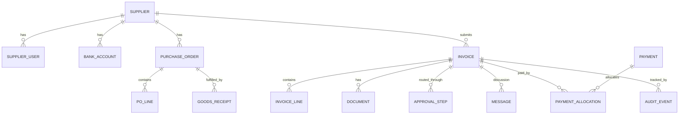

# Aljeel Supplier AP Portal — Data Model

> Entities, relationships, and a reference Prisma schema. PostgreSQL is the system of
> record; documents live in object storage (referenced by `storageKey`).

---

## 1. Entity Overview



---

## 2. Core Entities (summary)

| Entity | Key fields | Notes |
|---|---|---|
| **Supplier** | legalName, crNumber, vatNumber, status, paymentTerms, defaultCurrency | Tenant root; synced with ERP |
| **SupplierUser** | supplierId, email, role, mfaEnabled | Scoped to one supplier |
| **BankAccount** | supplierId, iban, bankName, verificationStatus, verifiedBy | Versioned; maker-checker |
| **PurchaseOrder** | supplierId, poNumber, status, currency | Read-synced from ERP |
| **PoLine** | poId, description, qty, unitPrice, vatRate | |
| **GoodsReceipt** | poId, receivedQty, receivedAt | For 3-way match |
| **Invoice** | supplierId, invoiceNumber, date, poId, currency, subtotal, vat, total, status, source, matchResult | FSM-driven lifecycle; `invoiceNumber` uses `DRAFT-*` placeholder until OCR populates real value |
| **InvoiceLine** | invoiceId, description, qty, unitPrice, vatRate, amount, glCode, costCenter | Populated by OCR after upload; empty at draft creation |
| **Document** | invoiceId, type, storageKey, ocrData(JSON), virusScanStatus | Invoice PDF (`INVOICE`) required before submit; supporting files typed as `OTHER`, `DELIVERY_NOTE`, etc. |
| **ApprovalStep** | invoiceId, approverId, action, comment, slaDueAt | Workflow history |
| **Payment** | reference, amount, currency, paidAt, remittanceDocKey | From treasury/ERP |
| **PaymentAllocation** | paymentId, invoiceId, amount | Supports partial/grouped payments |
| **Notification** | userId, type, channel, readAt | |
| **Message** | invoiceId, authorId, body, createdAt | Two-way thread |
| **AuditEvent** | actorId, entity, entityId, action, before, after, ip, createdAt | Append-only/immutable |

---

## 3. Reference Prisma Schema

> Starting point for `apps/api`. Refine types/indexes during implementation. Money is
> stored as integer minor units (e.g. halalas) to avoid float errors — or use `Decimal`.

```prisma
// schema.prisma
generator client {
  provider = "prisma-client-js"
}

datasource db {
  provider = "postgresql"
  url      = env("DATABASE_URL")
}

enum SupplierStatus { PENDING ACTIVE SUSPENDED REJECTED }
enum UserRole { SUPPLIER_ADMIN SUPPLIER_USER AP_CLERK AP_APPROVER PROCUREMENT TREASURY VENDOR_MASTER SYSTEM_ADMIN AUDITOR }
enum VerificationStatus { PENDING VERIFIED REJECTED }
enum InvoiceStatus { DRAFT SUBMITTED UNDER_REVIEW APPROVED ON_HOLD REJECTED SCHEDULED PAID }
enum InvoiceSource { UPLOAD EMAIL XML BULK }
enum DocumentType { INVOICE DELIVERY_NOTE GRN_COPY CONTRACT TIMESHEET OTHER }
enum ScanStatus { PENDING CLEAN INFECTED FAILED }
enum ApprovalAction { PENDING APPROVED REJECTED HOLD }

model Supplier {
  id              String         @id @default(cuid())
  legalName       String
  crNumber        String?        @unique
  vatNumber       String?        @unique
  status          SupplierStatus @default(PENDING)
  paymentTerms    String?
  defaultCurrency String         @default("SAR")
  erpVendorId     String?        @unique
  createdAt       DateTime       @default(now())
  updatedAt       DateTime       @updatedAt

  users        SupplierUser[]
  bankAccounts BankAccount[]
  purchaseOrders PurchaseOrder[]
  invoices     Invoice[]
}

model SupplierUser {
  id         String   @id @default(cuid())
  supplierId String
  email      String   @unique
  fullName   String
  role       UserRole @default(SUPPLIER_USER)
  mfaEnabled Boolean  @default(false)
  isActive   Boolean  @default(true)
  createdAt  DateTime @default(now())

  supplier Supplier @relation(fields: [supplierId], references: [id])
  @@index([supplierId])
}

model BankAccount {
  id                 String             @id @default(cuid())
  supplierId         String
  iban               String
  bankName           String
  accountHolder      String
  verificationStatus VerificationStatus @default(PENDING)
  verifiedById       String?
  version            Int                @default(1)
  isActive           Boolean            @default(false)
  createdAt          DateTime           @default(now())

  supplier Supplier @relation(fields: [supplierId], references: [id])
  @@index([supplierId])
}

model PurchaseOrder {
  id         String   @id @default(cuid())
  supplierId String
  poNumber   String
  status     String
  currency   String   @default("SAR")
  erpPoId    String?  @unique
  createdAt  DateTime @default(now())

  supplier Supplier      @relation(fields: [supplierId], references: [id])
  lines    PoLine[]
  receipts GoodsReceipt[]
  invoices Invoice[]
  @@unique([supplierId, poNumber])
  @@index([supplierId])
}

model PoLine {
  id          String  @id @default(cuid())
  poId        String
  description String
  qty         Decimal
  unitPrice   Decimal
  vatRate     Decimal @default(15)
  po          PurchaseOrder @relation(fields: [poId], references: [id])
  @@index([poId])
}

model GoodsReceipt {
  id          String   @id @default(cuid())
  poId        String
  receivedQty Decimal
  receivedAt  DateTime
  po          PurchaseOrder @relation(fields: [poId], references: [id])
  @@index([poId])
}

model Invoice {
  id            String        @id @default(cuid())
  supplierId    String
  invoiceNumber String
  invoiceDate   DateTime
  poId          String?
  currency      String        @default("SAR")
  subtotal      Decimal       @default(0)
  vat           Decimal       @default(0)
  total         Decimal       @default(0)
  status        InvoiceStatus @default(DRAFT)
  source        InvoiceSource @default(UPLOAD)
  matchResult   Json?
  rejectionReason String?
  createdAt     DateTime      @default(now())
  updatedAt     DateTime      @updatedAt

  supplier     Supplier        @relation(fields: [supplierId], references: [id])
  po           PurchaseOrder?  @relation(fields: [poId], references: [id])
  lines        InvoiceLine[]
  documents    Document[]
  approvals    ApprovalStep[]
  messages     Message[]
  allocations  PaymentAllocation[]

  @@unique([supplierId, invoiceNumber])
  @@index([supplierId, status])
}

model InvoiceLine {
  id          String  @id @default(cuid())
  invoiceId   String
  description String
  qty         Decimal
  unitPrice   Decimal
  vatRate     Decimal @default(15)
  amount      Decimal
  glCode      String?
  costCenter  String?
  invoice     Invoice @relation(fields: [invoiceId], references: [id])
  @@index([invoiceId])
}

model Document {
  id              String       @id @default(cuid())
  invoiceId       String
  type            DocumentType @default(INVOICE)
  fileName        String
  storageKey      String
  mimeType        String
  sizeBytes       Int
  ocrData         Json?
  virusScanStatus ScanStatus   @default(PENDING)
  createdAt       DateTime     @default(now())
  invoice         Invoice      @relation(fields: [invoiceId], references: [id])
  @@index([invoiceId])
}

model ApprovalStep {
  id         String         @id @default(cuid())
  invoiceId  String
  approverId String?
  sequence   Int
  action     ApprovalAction @default(PENDING)
  comment    String?
  slaDueAt   DateTime?
  actedAt    DateTime?
  invoice    Invoice        @relation(fields: [invoiceId], references: [id])
  @@index([invoiceId])
}

model Payment {
  id              String   @id @default(cuid())
  reference       String   @unique
  amount          Decimal
  currency        String   @default("SAR")
  paidAt          DateTime
  remittanceDocKey String?
  createdAt       DateTime @default(now())
  allocations     PaymentAllocation[]
}

model PaymentAllocation {
  id        String  @id @default(cuid())
  paymentId String
  invoiceId String
  amount    Decimal
  payment   Payment @relation(fields: [paymentId], references: [id])
  invoice   Invoice @relation(fields: [invoiceId], references: [id])
  @@index([invoiceId])
}

model Notification {
  id        String   @id @default(cuid())
  userId    String
  type      String
  channel   String
  payload   Json
  readAt    DateTime?
  createdAt DateTime @default(now())
  @@index([userId, readAt])
}

model Message {
  id        String   @id @default(cuid())
  invoiceId String
  authorId  String
  body      String
  createdAt DateTime @default(now())
  invoice   Invoice  @relation(fields: [invoiceId], references: [id])
  @@index([invoiceId])
}

model AuditEvent {
  id        String   @id @default(cuid())
  actorId   String?
  entity    String
  entityId  String
  action    String
  before    Json?
  after     Json?
  ip        String?
  createdAt DateTime @default(now())
  @@index([entity, entityId])
}
```

---

## 4. Indexing & Integrity Notes

- Unique `(supplierId, invoiceNumber)` enforces **duplicate-invoice prevention** at the DB level.
- Unique `(supplierId, poNumber)` keeps PO references clean per tenant.
- `erpVendorId` / `erpPoId` map portal records to ERP records for sync/reconciliation.
- `AuditEvent` is append-only — no updates/deletes (enforce via app + DB permissions).
- Consider partitioning `Invoice`/`AuditEvent` by month for high-volume deployments.
